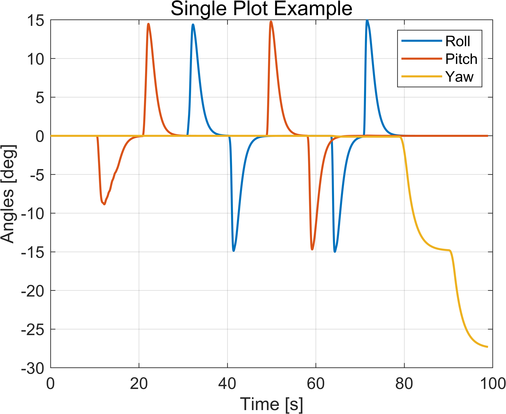
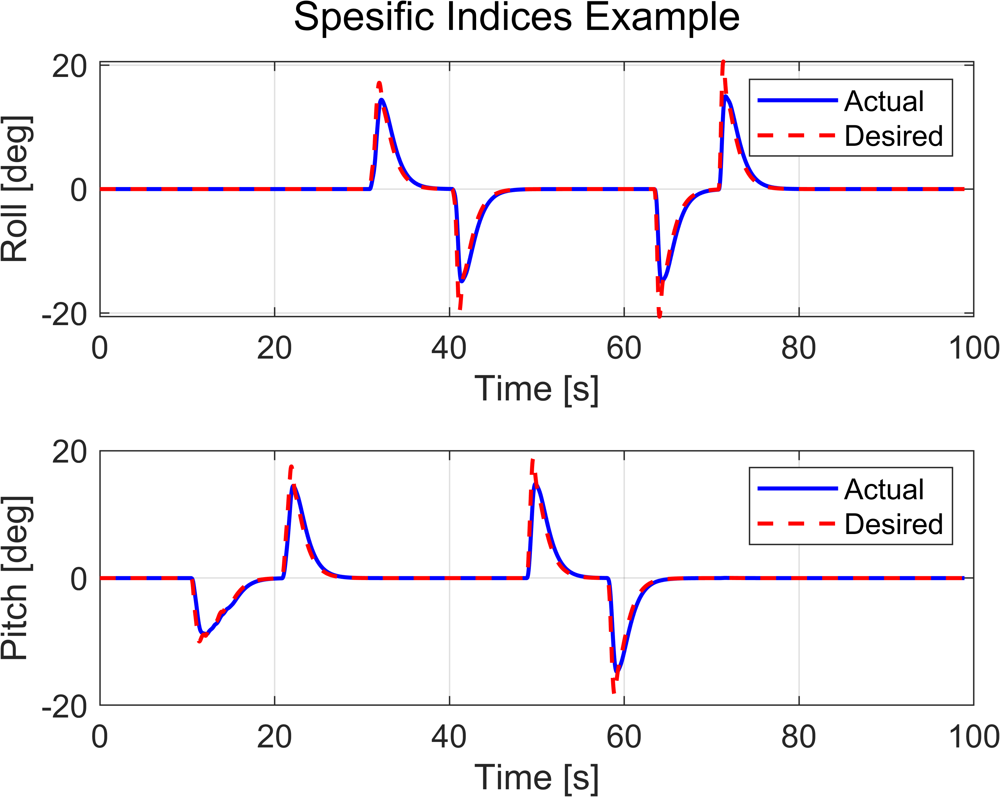
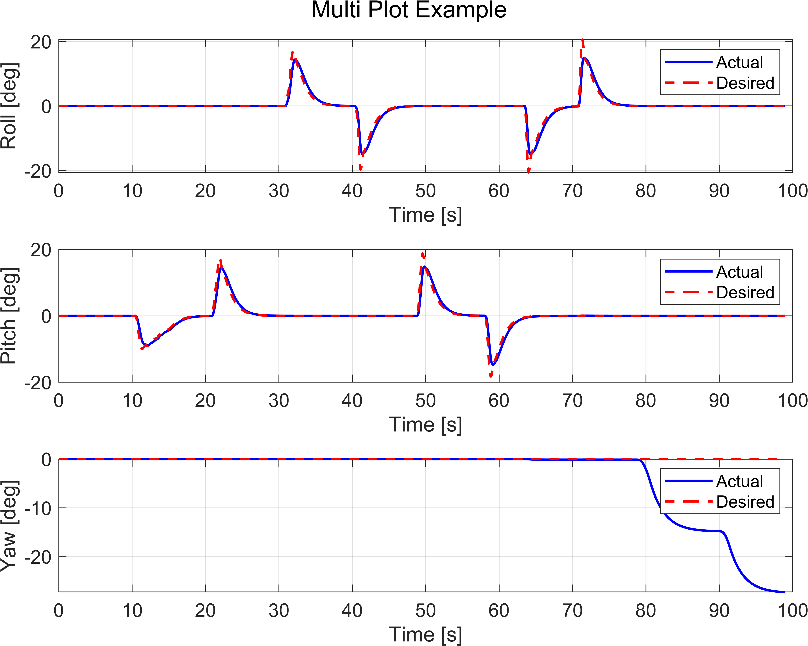

# CustomPlot

It is prepared to extract graphics from a mat file in Matlab in a modular way. You can specify the indices, labels and legends of the data you want to extract and get a graph quickly.

## Installation  

1. **Clone or download** the repository:  
   - **Clone**:  
     ```bash
     git clone https://github.com/mertcanakin/customPlot
     ```  
   - **Or** download the ZIP and extract it.  

2. **Run the script**:  
   - Load your data
   - Seperate the datas like the example log
   - Execute the 'main.m'

## Usage

```matlab
%% All subplots
customPlot(t, angles, ...
    'data_name', 'angles', ...
    'desired_data', desired_angles, ...
    'labels', {'Roll', 'Pitch', 'Yaw'}, ...
    'units', 'deg', ...
    'colors', {'blue', 'red'}, ...
    'legend_labels', {'Actual', 'Desired'}, ...
    'figure_size', [400 400 800 600]);

%% Spesific subplots
customPlot(t, angles, 'data_name', 'angles', ...
    'desired_data', desired_angles, ...
    'indices', [1 2], ...
    'labels', {'Roll', 'Pitch'}, ...
    'units', 'deg', ...
    'colors', {'blue', 'red'}, ...
    'legend_labels', {'Actual', 'Desired'});

%% Single subplot
customPlot(t, angles, 'subplot_layout', 'single', ...
    'labels', {'Angles'}, ...
    'units', 'deg', ...
    'legend_labels', {'Roll', 'Pitch', 'Yaw'});
```

| Parameter         | Type              | Description |
|-------------------|-------------------|-------------|
| `data_name`       | `string`          | Name of the dataset (used in figure title or saving) |
| `desired_data`    | `NxM matrix`      | Desired/reference data to plot along with actual data |
| `labels`          | `1xM cell array`  | Labels for each subplot (e.g., `{'Roll', 'Pitch', 'Yaw'}`) |
| `units`           | `string`          | Unit for the y-axis (e.g., `'deg'`, `'rad'`, `'m/s'`) |
| `colors`          | `1x2 cell array`  | Line colors for actual and desired data |
| `legend_labels`   | `1x2 cell array`  | Labels for the legend (e.g., `{'Actual', 'Desired'}`) |
| `figure_size`     | `1x4 vector`      | Figure size as `[x, y, width, height]` |
   
| Single Plot | Spesific Plot | Multi Plot|
|--------------------------|--------------------------| --------------------|
|  |  |  |

